# 📱 Praktikum Flutter — Aplikasi OCR Sederhana  

**Mata Kuliah:** Pemrograman Mobile  
**Dosen Pengampu:** Ade Ismail, S.Kom., M.TI  
**Nama:** Alfin Afriansyah  
**NIM:** 2341760089  
**Kelas:** SIB 3C  

---

## 🎯 Tujuan Praktikum

Setelah menyelesaikan praktikum ini, mahasiswa mampu:
- Membuat aplikasi Flutter multi-halaman.  
- Menggunakan plugin kamera untuk mengambil gambar.  
- Mengintegrasikan **OCR (Optical Character Recognition)** menggunakan library `google_mlkit_text_recognition`.  
- Menampilkan hasil OCR di halaman hasil.  
- Menerapkan navigasi dasar antar layar menggunakan `Navigator`.

---

## 🧰 Alat dan Bahan
- Laptop/komputer dengan Flutter SDK terinstal  
- VS Code atau Android Studio  
- Emulator Android atau perangkat fisik  
- Koneksi internet (untuk instalasi dependensi)  

---

## ⚙️ Langkah Kerja (Ringkasan)
1. **Membuat Proyek Baru**
   ```bash
   flutter create ocr_sederhana
   cd ocr_sederhana
   ```
2. **Menambahkan Plugin**
   Tambahkan dependensi berikut ke `pubspec.yaml`:
   ```yaml
   dependencies:
     google_mlkit_text_recognition: ^0.11.0
     camera: ^0.10.6
     path_provider: ^2.1.3
     path: ^1.8.3
   ```
   lalu jalankan:
   ```bash
   flutter pub get
   ```
3. **Menambahkan Izin Kamera (Android)**
   Tambahkan di `AndroidManifest.xml` sebelum `<application>`:
   ```xml
   <uses-permission android:name="android.permission.CAMERA" />
   ```
4. **Membuat Struktur Folder**
   ```
   lib/
   ├── main.dart
   └── screens/
       ├── splash_screen.dart
       ├── home_screen.dart
       ├── scan_screen.dart
       └── result_screen.dart
   ```

---

## 📷 Dokumentasi Aplikasi

- Tampilan Home Screen

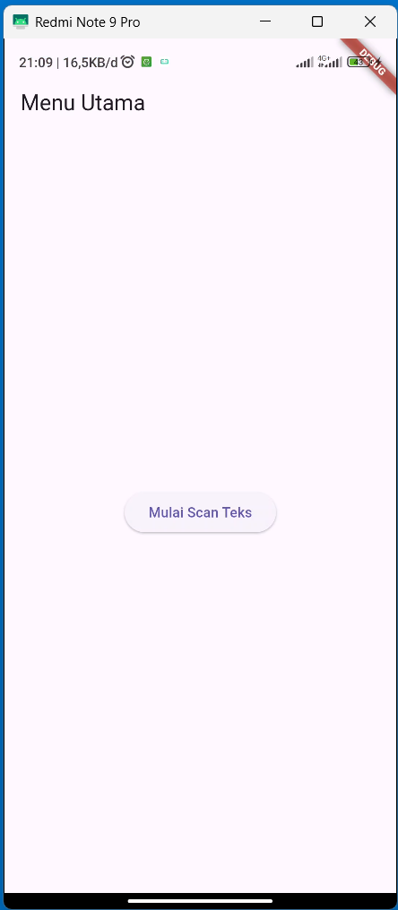

-Tampilan Scan Screen

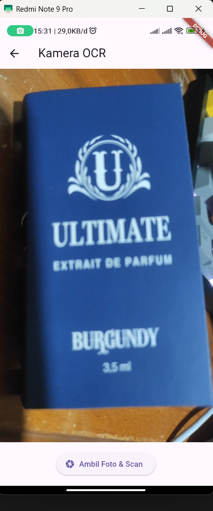

-Tampilan Result Screen

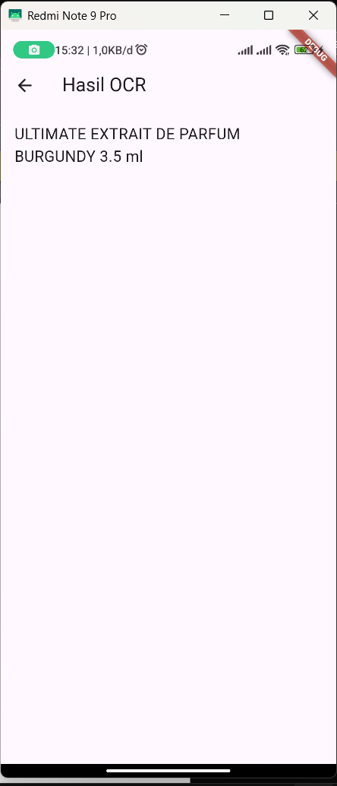

---

## 📋 Tugas Praktikum & Jawaban

### a. Apakah semua teks terbaca dengan akurat? Mengapa?

Tidak, tidak semua teks dapat terbaca dengan akurat 100% oleh OCR.
Meskipun teknologi OCR sudah sangat canggih, tingkat akurasi pengenalannya bervariasi dan dipengaruhi oleh beberapa faktor, yaitu:
- Kualitas Gambar Sumber: Gambar atau dokumen dengan resolusi rendah, buram, terlalu terang/gelap (kontras kurang optimal), terdapat noda, atau kondisi fisiknya rusak (kusut, terlipat) akan menurunkan akurasi OCR secara signifikan.
- Jenis dan Kualitas Teks: OCR biasanya lebih akurat pada teks cetak yang jelas dengan jenis huruf (font) standar. Akurasi akan menurun pada:
    - Tulisan tangan (walaupun beberapa teknologi OCR canggih/ICR sudah mampu mengatasinya).
    - Teks dengan font dekoratif atau tidak umum.
    - Teks yang terlalu kecil atau terlalu padat.
- Noise (Gangguan): Keberadaan "noise" seperti titik-titik acak, latar belakang yang ramai, atau bayangan pada gambar dapat menyebabkan sistem OCR salah mengenali karakter.

---

### b. Apa kegunaan fitur OCR dalam kehidupan sehari-hari?
- Konversi Dokumen Fisik ke Digital: Mengubah surat, buku, kuitansi, faktur, atau dokumen kertas lainnya yang dipindai (scan) atau difoto menjadi teks digital yang dapat disunting (diedit) di aplikasi pengolah kata. Ini mempermudah pengarsipan.
- Pencarian Teks: Memungkinkan pengguna untuk mencari kata atau frasa tertentu di dalam dokumen berbasis gambar (misalnya, di dalam file PDF yang dipindai).
- Ekstraksi Data Cepat: Mengambil informasi spesifik seperti nomor telepon, alamat, atau harga dari kartu nama, papan informasi, atau struk belanja hanya dengan memotretnya.
- Digitalisasi Catatan dan Arsip: Mendigitalkan koleksi buku, majalah, atau catatan tulisan tangan/cetak lama sehingga lebih mudah disimpan, dicari, dan dibagikan.

---

### c. Sebutkan 2 contoh aplikasi nyata yang menggunakan OCR!
- Google Lens / Google Foto (Google Search):
    Kegunaan: Memungkinkan pengguna untuk mengambil foto teks dari dunia nyata (misalnya, plang nama, menu, atau catatan) dan langsung menyalin teks tersebut ke ponsel, mencarinya di Google, atau menerjemahkannya.
- CamScanner (atau aplikasi pemindai dokumen sejenis):
    Kegunaan: Digunakan untuk memindai dokumen kertas menggunakan kamera ponsel dan mengubah gambar hasil pindaian (scan) menjadi file PDF yang dapat dicari (searchable PDF) atau langsung mengekstrak teks di dalamnya untuk diedit.

---

## UTS Praktikum Pemrograman Mobile

### Soal 1: Modifikasi Struktur Navigasi dan Aliran 

Tujuan: Menyederhanakan alur navigasi dan meningkatkan pengalaman pengguna diHomeScreen.

#### 1. Pengubahan Navigasi Home 
- UbahElevatedButtondiHomeScreen(lib/screens/home_screen.dart) menjadi *widget* **ListTile**.
- AturListTile: leading: Icon(Icons.camera_alt, color: Colors.blue); title: Text(’Mulai Pindai Teks Baru’).
- Fungsi onTap harus menggunakan Navigator.push() untuk ke ScanScreen.

📷 Screenshot Kode:
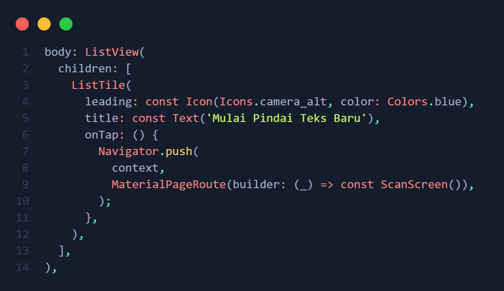

#### 2. Teks Utuh dan Navigasi Balik
- DiResultScreen(lib/screens/result_screen.dart), hapus fungsi ocrText.replaceAll(’\n’,”) agar hasil teks ditampilkan dengan baris baru (\n) yang utuh.
- Tambahkan FloatingActionButton dengan ikon Icons.home.
- Ketika tombol ditekan, navigasi harus kembali langsung ke HomeScreen menggunakan **Navigator.pushAndRemoveUntil()** (atau metode yang setara) untuk menghapus semua halaman di atasnya dari stack navigasi.

📷 Screenshot Kode:
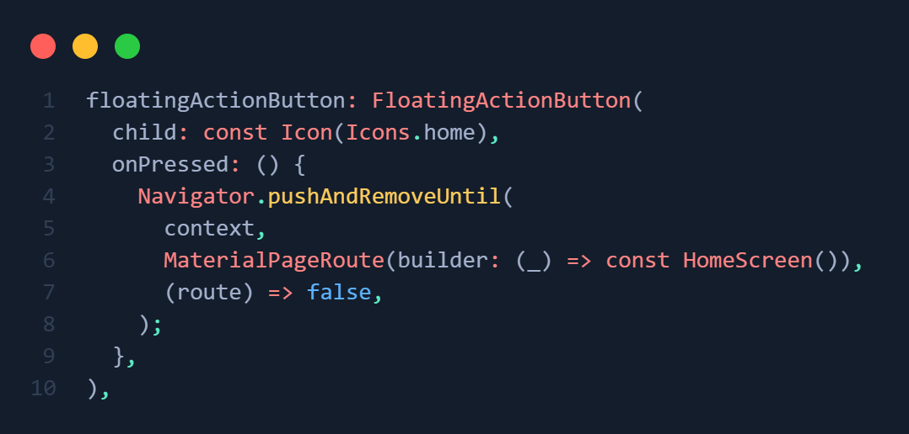

#### 📷 Screenshot Hasil:
<p align="center">
  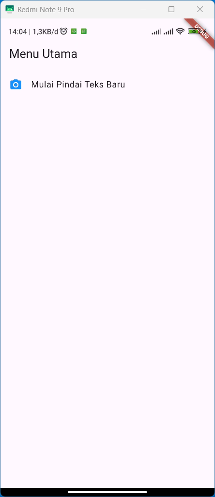
  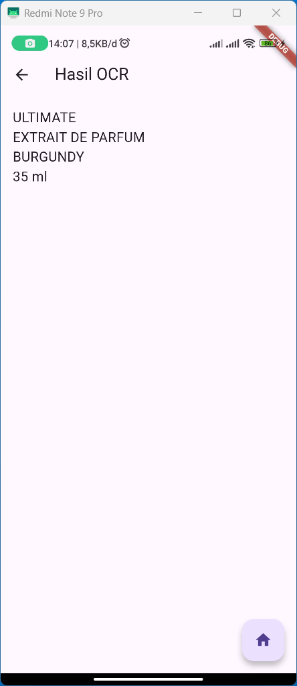
</p>

---

### Soal 2: Penyesuaian Tampilan dan Penanganan State/Error 

Tujuan: Memperbaiki tampilan *loading* dan memberikan *feedback* error yang lebih jelas.

#### 1. Custom Loading Screen di ScanScreen 
- DiScanScreen(lib/screens/scan_screen.dart), modifikasi tampilan *loading* yang muncul sebelum kamera siap (if (!controller.value.isInitialized)) :
- Latar Belakang: Scaffold(backgroundColor: Colors.grey[900]).
- Isi: Di dalam Center, tampilkan Column berisi CircularProgressIndicator(color: Colors.yellow).
- Di bawah indikator, tambahkan Text(’Memuat Kamera... Harap tunggu.’, style: TextStyle(color: Colors.white, fontSize: 18)).

📷 Screenshot Kode:
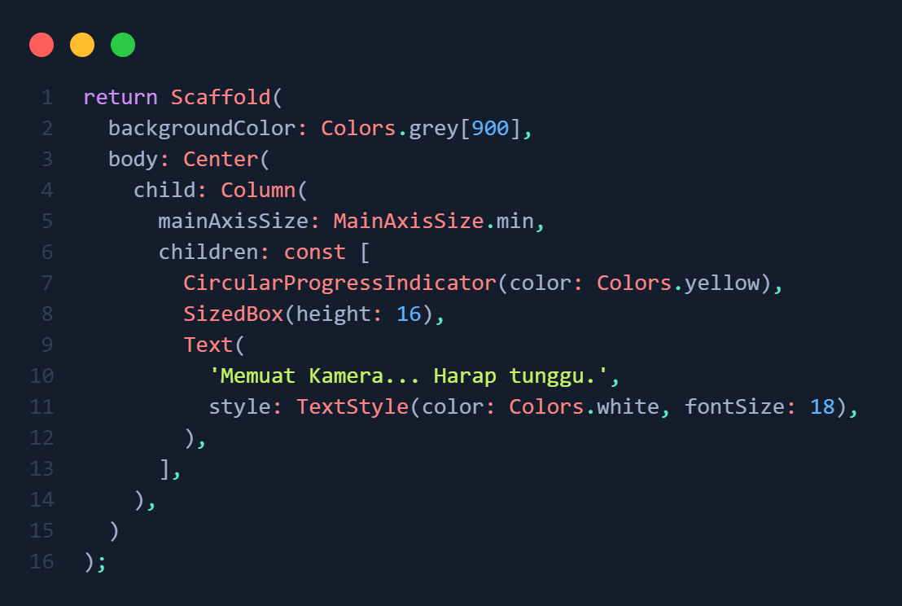

#### 2. Spesifikasi Pesan Error
- Di fungsi _takePicture() pada ScanScreen, modifikasi blok catch (e) untuk mengubah pesan *error* pada SnackBar.
- Pesan SnackBar harus berbunyi: "Pemindaian Gagal! Periksa Izin Kamera atau coba lagi." (Hilangkan variabel *error* ($e)).

📷 Screenshot Kode:
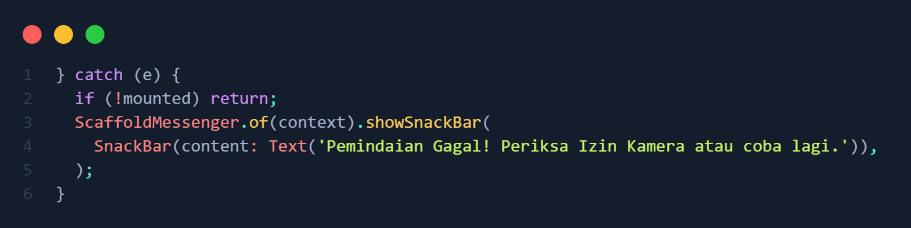

#### 📷 Screenshot Hasil:
<p align="center">
  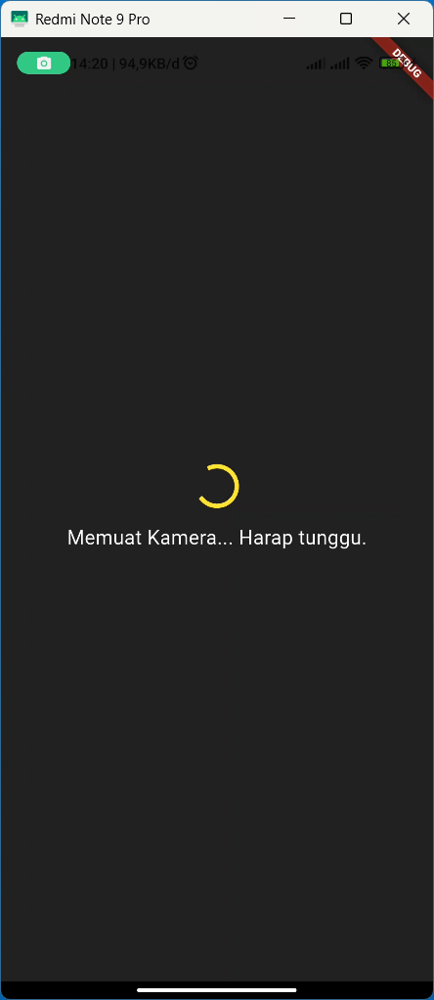
  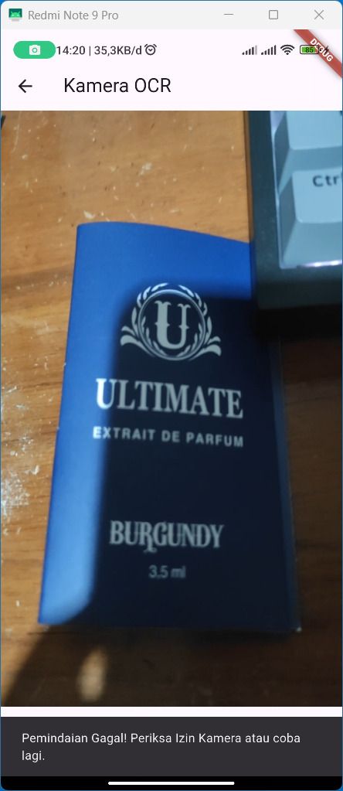
</p>

---

### Soal 3: Implementasi Plugin Text-to-Speech (TTS) 

Tujuan: Mengintegrasikan fitur membaca teks secara lisan menggunakan *plugin* flutter_tts.

#### 1.	Instalasi Plugin
-	Tambahkan *plugin* flutter_tts ke dalam file pubspec.yaml (gunakan versi terbaru yang kompatibel).
-	Jalankan flutter pub get.

📷 Screenshot Kode:
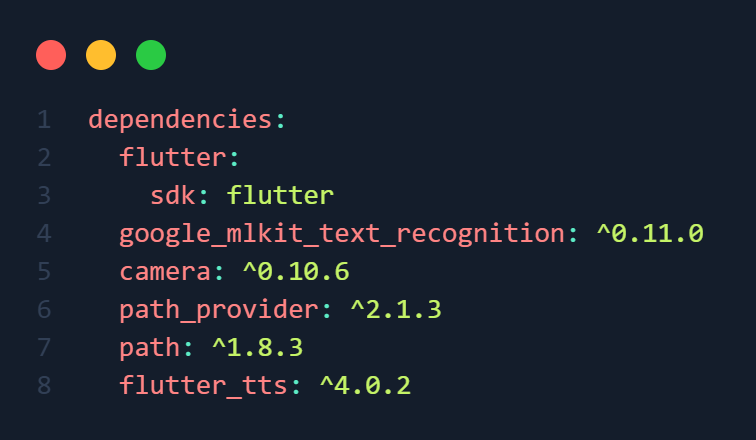

#### 2.	Konversi Widget dan Inisialisasi (10 Poin):
-	Ubah ResultScreen dari StatelessWidget menjadi **StatefulWidget**.
-	Di initState(), inisialisasi FlutterTts dan atur bahasa pembacaan menjadi Bahasa Indonesia.
-	Implementasikan dispose() untuk menghentikan mesin TTS saat halaman ditutup.

📷 Screenshot Kode:
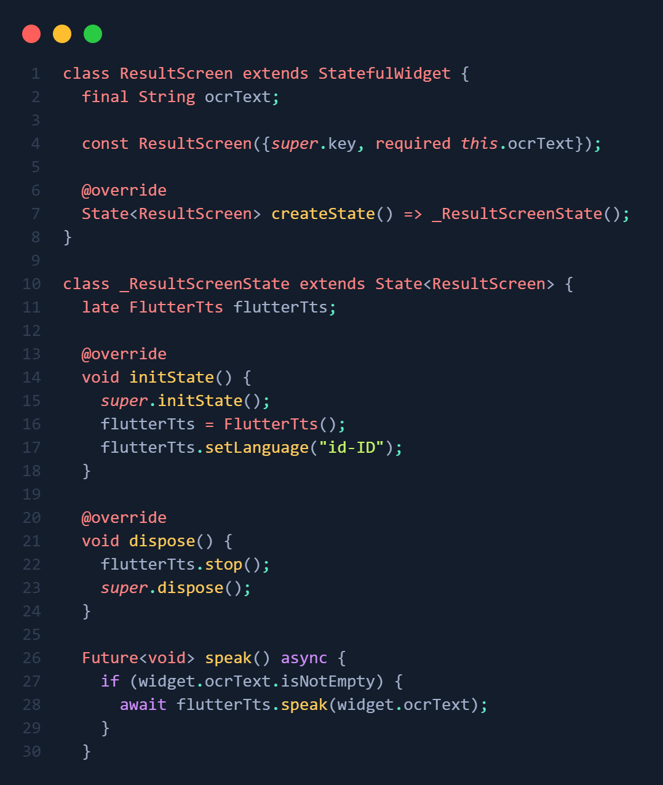

#### 3.	Fungsionalitas Pembacaan (15 Poin):
-	TambahkanFloatingActionButtonkeduadiResultScreen (atau ganti AppBar dengan action button) dengan ikon Icons.volume_up.
-	Ketika tombol ditekan, panggil fungsi speak() pada FlutterTts untuk membacakan seluruh isi ocrText.

📷 Screenshot Kode:
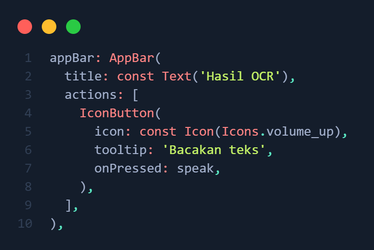

#### 📷 Screenshot Hasil:
<p align="center">
  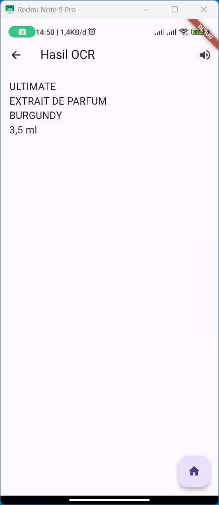
</p>